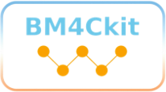

# BM4Ckit
## Batched Machine-learning for Catalysts kit
A Python-based package containing various tools for machine learning applied in catalytic chemistry, 
including reading, writing, filtering, modifying, and format conversion of batched structure files, training ML models, model predictions, ML-potential-based batched structure optimization and molecular dynamics, etc.

Manuals would be completed soon. You can find the current manuals in [Manual](Manual/).

The project is still in an early version and may change significantly in the future.

These following third-party libraries are used:
- **PyTorch** (BSD-3-Clause License), Copyright © 2016-present Facebook Inc.  
- **NumPy** (BSD-3-Clause License), Copyright © 2005-2025 NumPy Developers.
- **Joblib** (BSD-3-Clause License), Copyright © 2008-2021, The joblib developers.

These following third-party libraries are optional:
- **DGL** (Apache-2.3 License)
- **torch-geometric** (MIT License)
- **ASE** (LGPL-v2.1 License) [ASE](https://gitlab.com/ase/ase/-/tree/master?ref_type=heads)

See [LICENSES/](LICENSES/) for full license texts.
